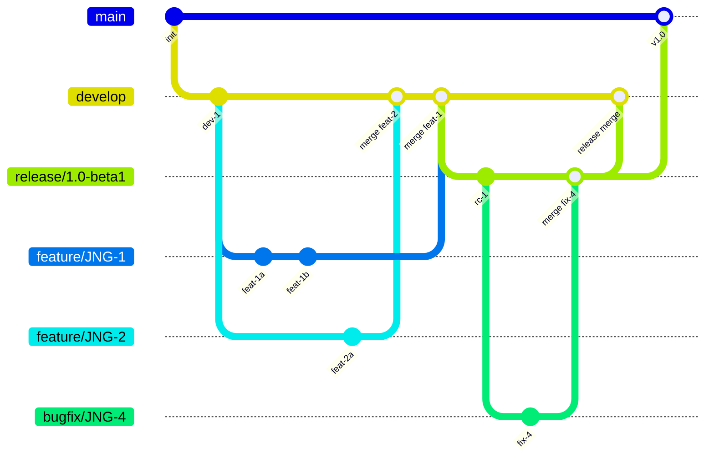
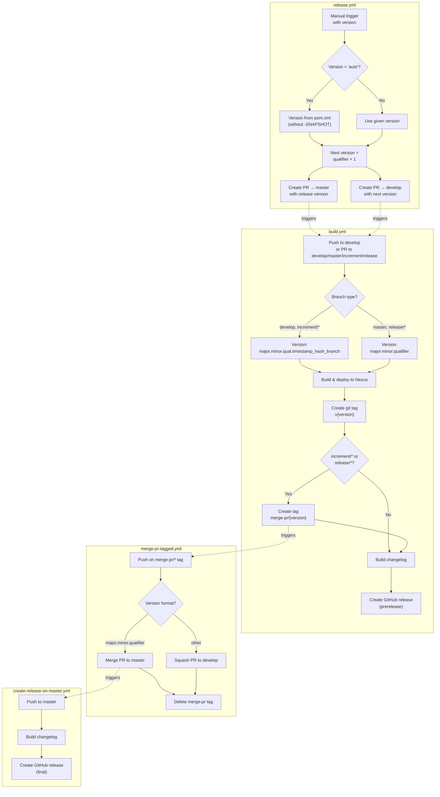

# Development Version and Branch Handling

This document describes the Git branching strategy, versioning policy, and CI/CD automation workflows used by this project.

## Branches

The versioning and branching strategy follows [GitFlow](https://www.atlassian.com/git/tutorials/comparing-workflows/gitflow-workflow).

| Branch Pattern | Base Branch | Purpose |
|----------------|-------------|---------|
| `develop` | — | Main development branch with the latest sources of the active version |
| `feature/JNG-NUMBER_short_summary` | `develop` | New features for the next release |
| `(release/)X.Y.Z` | `develop` | Stabilization branch for a specific release (the `release/` prefix is reserved for CI) |
| `bugfix/JNG-NUMBER_short_summary` | release branch | Bug fixes during release testing — must also be applied to newer release and develop branches |
| `support/JNG-NUMBER_short_summary` | release branch | Minor changes to a previous release; merged back to the release branch |
| `hotfix/JNG-NUMBER_short_summary` | `master` | Critical fixes applied to both release and master branches |
| `master` | — | Contains the latest released (stable) sources |

## Version Numbers

Versions follow semantic versioning with these rules:

| Event | Version Change | Example |
|-------|---------------|---------|
| Start a `feature/` branch | No change | Inherits from `develop` |
| Start a `release/` branch | Increment 2nd number on `develop` | `1.1.0-SNAPSHOT` → `1.2.0-SNAPSHOT` |
| Start a `bugfix/` branch | No change | Applied on release branch before merge to `master` |
| Start a `support/` branch | Increment 3rd number | `1.0.0` → `1.0.1` |
| Start a `hotfix/` branch | Increment 4th number | `1.0.0` → `1.0.0.1` |

### Development vs. Release Versions

- **Development builds** (from `develop` or `increment/*`): version is `major.minor.qualifier.timestamp_commitHash_branchName`
- **Release builds** (from `master` or `release/*`): version is the clean `major.minor.qualifier` from `pom.xml`

## GitHub Actions Workflows

The CI/CD pipeline is composed of four interconnected workflows:

### Workflow Details

#### `build.yml` — Main CI Pipeline

This is the primary build workflow triggered on every push to `develop` and on pull requests targeting `develop`, `master`, `increment/*`, or `release/*` branches.

**What it does:**
1. Calculates the version — development builds get a timestamped qualifier, release builds use the clean version from `pom.xml`
2. Builds the project and deploys artifacts to the JuDong Nexus repository
3. Creates a git tag `v{version}`
4. For `increment/*` and `release/*` branches, creates an additional `merge-pr/{version}` tag that triggers the merge workflow
5. For `develop` builds, generates a changelog and creates a GitHub prerelease

#### `merge-pr-tagged.yml` — PR Merge Handler

Triggered when a `merge-pr/*` tag is pushed. Routes the PR to the correct target:
- **Clean version** (`major.minor.qualifier`) → merge to `master` (triggers release on master)
- **Development version** → squash merge to `develop` (triggers a new develop build)

Cleans up the `merge-pr/*` tag after processing.

#### `create-release-on-master.yml` — Master Release

Triggered on push to `master`. Builds a changelog and creates a final (non-prerelease) GitHub release.

#### `release.yml` — Manual Release Trigger

Manually triggered with an optional version parameter:
- `auto` — reads the version from `pom.xml` (stripping `-SNAPSHOT`)
- Any `major.minor.qualifier` — uses the given version directly

Creates two pull requests:
1. PR to `master` with the release version
2. PR to `develop` with the next incremented version

## Development Guidelines

> **Important:** There is no commit without a JIRA ticket number. Every commit and PR must reference `JNG-xxx` in the message.

For issue tracking, use [JIRA](https://blackbelt.atlassian.net/jira/dashboards).
