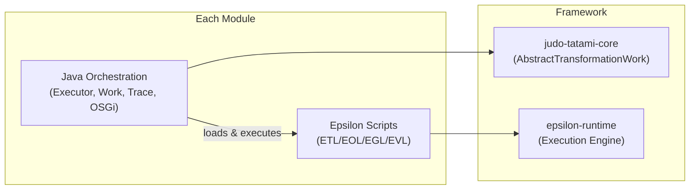

# Contributing to JUDO Tatami Base

## Development Environment

Ensure your development environment meets these requirements:

- **Java 21** JDK (source and target)
- **Maven 3.9.4+** (or use the included `./mvnw` wrapper)
- JVM configured with the flags in `.mvn/jvm.config` (handled automatically by the wrapper)

For full environment setup details, see the parent project's [Contributing Guide](https://github.com/BlackBeltTechnology/judo-community/blob/develop/CONTRIBUTING.adoc).

## Code Structure

This project is a multi-module Maven project where each module implements one step of the JUDO model transformation pipeline. All modules are packaged as OSGi bundles.

Each transformation module follows a consistent pattern with four key classes:

| Class | Naming Convention | Role |
|-------|-------------------|------|
| Transformation executor | `{Module}.java` | Static methods that run the transformation via Epsilon scripts |
| Work unit | `{Module}Work.java` | Integrates transformation into workflow pipelines via `AbstractTransformationWork` |
| Trace handler | `{Module}TransformationTrace.java` | Records source-to-target EObject mappings for traceability |
| OSGi service | `{Module}TransformationSerivce.java` | Registers the transformation as an OSGi service with model tracking |

The core transformation logic lives in Eclipse Epsilon scripts (ETL/EOL/EGL/EVL) under `src/main/epsilon/`, not in Java code. Java handles orchestration, configuration, and framework integration.



## Submitting an Issue

Before submitting an issue, search the [issue tracker](https://github.com/BlackBeltTechnology/judo-tatami-base/issues) — your problem may already be reported or resolved.

To help us reproduce and fix bugs quickly, please include:

- Output of `java -version` and `mvn -version`
- The relevant `pom.xml` or `.flattened-pom.xml`
- A minimal reproducible use case that demonstrates the failure

We require a minimal reproduction to efficiently isolate and fix problems. File new issues using the [issue form](https://github.com/BlackBeltTechnology/judo-tatami-base/issues/new/choose).

## Submitting a Pull Request

This project follows [GitHub's standard forking model](https://guides.github.com/activities/forking/). Fork the repository, create a feature branch, and submit a pull request.

> **Important:** Every commit must reference a JIRA ticket number (`JNG-XXXX`). There is no commit without a ticket number.

## Commands

### Run Tests

```bash
mvn clean test
```

### Run Full Build

```bash
mvn clean install
```

### Run a Single Module's Tests

```bash
mvn clean test -pl judo-tatami-psm2asm
```
