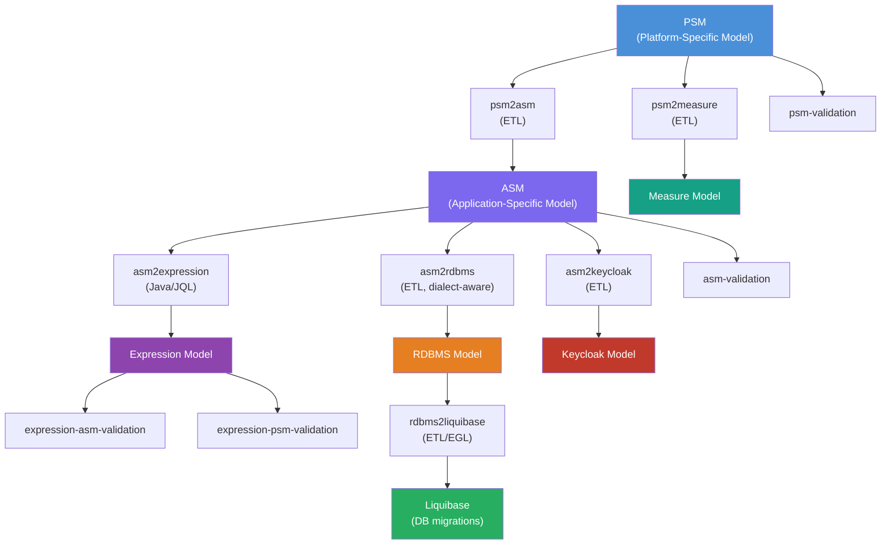
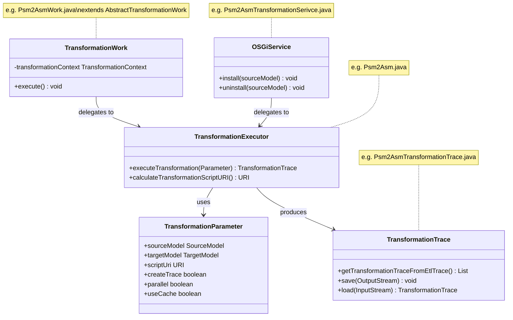

# JUDO Tatami Base

[](https://github.com/BlackBeltTechnology/judo-tatami-base/actions/workflows/build.yml)

## Introduction

JUDO Tatami Base is the model transformation pipeline for the [JUDO platform](https://github.com/BlackBeltTechnology/judo-community). It converts high-level Platform-Specific Models (PSM) through a series of automated transformation steps into concrete implementation artifacts — application models (ASM), database schemas (RDBMS), migration scripts (Liquibase), expression models, measurement units, and identity provider configurations (Keycloak).

Each transformation step is implemented as an independent Maven module packaged as an OSGi bundle. The actual transformation logic is written in [Eclipse Epsilon](https://www.eclipse.org/epsilon/) ETL/EOL/EGL scripts, while Java code handles orchestration, configuration, traceability, and OSGi service registration.

> **Note:** This project contains pipeline steps only. These steps are composed into complete workflows by other projects such as [judo-tatami-jsl](https://github.com/BlackBeltTechnology/judo-tatami-jsl).

## Transformation Pipeline

The pipeline transforms models through progressively more concrete representations:



## Module Overview

| Module | Input → Output | Engine | Description |
|--------|---------------|--------|-------------|
| `judo-tatami-psm2asm` | PSM → ASM | Epsilon ETL | Converts platform-specific types, entities, and relations into application-specific structures |
| `judo-tatami-psm2measure` | PSM → Measure | Epsilon ETL | Extracts measurement unit definitions from PSM |
| `judo-tatami-asm2rdbms` | ASM → RDBMS | Epsilon ETL | Generates relational database schema with dialect support (HSQLDB, PostgreSQL, Oracle) |
| `judo-tatami-asm2expression` | ASM → Expression | Java (JQL Builder) | Builds expression trees from JQL queries on ASM models |
| `judo-tatami-asm2keycloak` | ASM → Keycloak | Epsilon ETL | Generates identity/authorization model for Keycloak integration |
| `judo-tatami-rdbms2liquibase` | RDBMS → Liquibase | Epsilon ETL/EGL | Generates Liquibase database migration changesets (full and incremental) |
| `judo-tatami-psm-validation` | PSM | Epsilon EVL | Validates PSM model constraints |
| `judo-tatami-asm-validation` | ASM | Epsilon EVL | Validates ASM model constraints |
| `judo-tatami-expression-asm-validation` | Expression + ASM | Epsilon EVL | Validates expression models against ASM |
| `judo-tatami-expression-psm-validation` | Expression + PSM | Epsilon EVL | Validates expression models against PSM |

## Architecture Patterns

Each transformation module follows a consistent four-class pattern:



**Integration patterns:**
- **Direct Java API** — call `Psm2Asm.executePsm2AsmTransformation(parameter)` with a builder-based parameter object
- **Workflow integration** — use `Psm2AsmWork` with a `TransformationContext` that manages model dependencies between steps
- **OSGi runtime** — models are discovered via service trackers and transformations run automatically on registration

## Epsilon Script Organization

Transformation logic is primarily declarative, written in Eclipse Epsilon languages:

| Language | Extension | Purpose |
|----------|-----------|---------|
| **ETL** (Epsilon Transformation Language) | `.etl` | Model-to-model transformation rules |
| **EOL** (Epsilon Object Language) | `.eol` | Utility operations and shared logic |
| **EGL** (Epsilon Generation Language) | `.egl` | Template-based code/SQL generation |
| **EVL** (Epsilon Validation Language) | `.evl` | Model validation constraints |

Scripts are located at `src/main/epsilon/transformations/` within each module and copied to `target/classes/tatami/{module}/transformations/` during build.

## Database Dialect Support

The `asm2rdbms` module supports three SQL dialects with configurable naming conventions:

| Parameter | HSQLDB | PostgreSQL | Oracle |
|-----------|--------|------------|--------|
| `tableNameMaxSize` | 128 | 63 | 30 |
| `columnNameMaxSize` | 128 | 63 | 30 |
| Prefixes | `T_`, `C_`, `FK_`, `J_` | `T_`, `C_`, `FK_`, `J_` | `T_`, `C_`, `FK_`, `J_` |

Dialect-specific RDBMS mapping models are generated at build time by `ExcelMappingModels2Rdbms`.

## Build & Development

**Prerequisites:** Java 21, Maven 3.9.4+

```bash
# Full build
mvn clean install

# Run all tests
mvn clean test

# Run tests for one module
mvn clean test -pl judo-tatami-psm2asm

# Run a specific test class
mvn clean test -pl judo-tatami-psm2asm -Dtest=Psm2AsmTest
```

The Maven wrapper (`./mvnw`) is included in the repository.

## Context

This project is a building block of the [judo-community](https://github.com/BlackBeltTechnology/judo-community) aggregator project. For a broader understanding of how this module fits into the JUDO ecosystem, see the corresponding documentation.

## Contributing

Everyone is welcome to contribute to JUDO! Please read the [Contributing Guide](CONTRIBUTING.md) for details.

## License

This project is licensed under the [Eclipse Public License - v 2.0](https://www.eclipse.org/legal/epl-2.0/).
