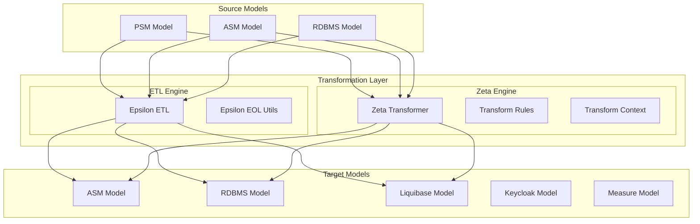

# Design: Zeta Dual Transformation System

## Architecture Overview



## Zeta Framework Version

```xml
<judo-zeta-version>1.0.0.20251210_001523_3862a79a_feature_JNG_6349_Epsiolon2Java</judo-zeta-version>
```

## Zeta Framework Annotations

The Zeta framework provides the following annotations for declarative transformation rules:

### Core Annotations

| Annotation | Target | Description |
|------------|--------|-------------|
| `@TransformationContext` | Class | Marks a class as containing transformation rules, specifies source/target types |
| `@TransformRule` | Method | Defines a transformation rule with name and optional type overrides |
| `@Guard` | Method | Conditional execution - references a predicate method |
| `@Abstract` | Method | Abstract rule - only invoked via inheritance |
| `@Extends` | Method | Rule inheritance - specifies parent rules |
| `@Lazy` | Method | Lazy evaluation - only executed via equivalent() calls |
| `@Greedy` | Method | Broader type matching - matches subtypes (kind-of semantics) |
| `@Primary` | Method | Primary rule - results precede others in equivalent() |
| `@PreExecution` | Method | Hook executed before transformation |
| `@PostExecution` | Method | Hook executed after transformation |

### TransformFunction Interface

```java
@FunctionalInterface
public interface TransformFunction<S extends EObject, T extends EObject> {
    T transform(S source, TransformationContext context);
}
```

### TransformationContext API

The `TransformationContext` provides:

```java
// Create target elements
<T extends EObject> T createTarget(Class<T> targetType);

// Get equivalent target for source (triggers lazy rules if needed)
<T extends EObject> T equivalent(EObject source, Class<T> targetType);

// Get all equivalents for source
<T extends EObject> List<T> equivalents(EObject source, Class<T> targetType);

// Execute parent rule (for @Extends inheritance)
<T extends EObject> T executeParentRule(String parentRuleName, EObject source);

// Get all source instances of a type
<T extends EObject> Collection<T> getAllSource(Class<T> sourceType);

// Call extension methods
<T> T call(EObject target, String methodName, Object... args);

// Custom attributes for pre/post hooks
void setAttribute(String key, Object value);
<T> T getAttribute(String key);
```

## Proper Zeta Transformation Pattern

### Rule Name Constants

Each module must define a constants class for all rule names. This ensures consistency and enables safe refactoring:

```java
/**
 * Constants for all PSM2ASM rule names.
 * Rule names must exactly match ETL rule names.
 */
public final class Psm2AsmRuleNames {
    // namespace.etl
    public static final String NAMESPACE_TO_PACKAGE = "NamespaceToPackage";
    public static final String MODEL_TO_PACKAGE = "ModelToPackage";
    
    // data.etl
    public static final String CREATE_ENTITY_CLASS = "CreateEntityClass";
    public static final String ADD_ATTRIBUTE_CONSTRAINTS = "AddAttributeConstraints";
    public static final String ADD_STRING_ATTRIBUTE_CONSTRAINTS = "AddStringAttributeConstraints";
    
    // ... all 137 rule names
    
    private Psm2AsmRuleNames() {}
}
```

### Transformation Class Structure

Each ETL rule maps 1:1 to a `@TransformRule` annotated method returning `TransformFunction<S, T>`. **Always use constants for rule names:**

```java
import static hu.blackbelt.judo.tatami.psm2asm.zeta.Psm2AsmRuleNames.*;

@TransformationContext(source = EntityType.class, target = EClass.class)
public class Psm2AsmDataTransformations {

    @TransformRule(name = CREATE_ENTITY_CLASS)
    @Primary
    public TransformFunction<EntityType, EClass> createEntityClass() {
        return (s, ctx) -> {
            EClass t = ctx.createTarget(EClass.class);
            t.setName(s.getName());
            t.setAbstract(s.isAbstract());
            
            for (EntityType superType : s.getSuperEntityTypes()) {
                t.getESuperTypes().add(ctx.equivalent(superType, EClass.class));
            }
            
            EPackage pkg = ctx.equivalent(s.eContainer(), EPackage.class);
            pkg.getEClassifiers().add(t);
            
            return t;
        };
    }
    
    @TransformRule(name = ADD_ATTRIBUTE_CONSTRAINTS)
    @Abstract
    public TransformFunction<Attribute, EAnnotation> addAttributeConstraints() {
        return (s, ctx) -> {
            EAnnotation t = ctx.createTarget(EAnnotation.class);
            t.setSource(asmUtils.getAnnotationUri("constraints"));
            
            EAttribute attr = ctx.equivalent(s, EAttribute.class);
            attr.getEAnnotations().add(t);
            
            return t;
        };
    }
    
    @TransformRule(name = ADD_STRING_ATTRIBUTE_CONSTRAINTS)
    @Extends(ADD_ATTRIBUTE_CONSTRAINTS)
    @Guard(method = "isStringType")
    public TransformFunction<Attribute, EAnnotation> addStringAttributeConstraints() {
        return (s, ctx) -> {
            EAnnotation t = ctx.executeParentRule(ADD_ATTRIBUTE_CONSTRAINTS, s);
            
            StringType stringType = (StringType) s.getDataType();
            t.getDetails().put("maxLength", String.valueOf(stringType.getMaxLength()));
            
            if (stringType.getRegExp() != null && !stringType.getRegExp().trim().isEmpty()) {
                t.getDetails().put("pattern", stringType.getRegExp());
            }
            
            return t;
        };
    }
    
    public boolean isStringType(Attribute attr, TransformationContext ctx) {
        return attr.getDataType() instanceof StringType;
    }
}
```

---

## All Transformation Rules (228 Total)

### Summary by Module

| Module | ETL Files | Rules | Key Patterns |
|--------|-----------|-------|--------------|
| judo-tatami-psm2asm | 8 | 137 | @Abstract inheritance, @Guard for type-specific |
| judo-tatami-psm2measure | 2 | 5 | @Abstract + @Extends for measure types |
| judo-tatami-asm2rdbms | 4 | 21 | @Primary, @Lazy for junction tables |
| judo-tatami-rdbms2liquibase | 10 | 63 | @Greedy, @Lazy for table/field mappings |
| judo-tatami-asm2keycloak | 2 | 2 | Guards for realm-enabled actors |
| **Total** | **26** | **228** | |

### Already Java-Based (No Migration Needed)

| Module | Implementation | Notes |
|--------|----------------|-------|
| judo-tatami-asm2expression | `AsmJqlExtractor` | Already uses Java-based JQL expression extraction, not ETL |

---

## PSM2ASM Transformation Rules (137 Rules)

### Module: namespace.etl (5 rules)

| ETL Rule | Zeta Annotation | Source Type | Target Type |
|----------|-----------------|-------------|-------------|
| `NamespaceToPackage` | `@Abstract` | Namespace | EPackage |
| `ModelToPackage` | `@Extends("NamespaceToPackage")` | Model | EPackage |
| `ModelToPackageVersion` | - | Model | EAnnotation |
| `PackageToPackage` | `@Extends("NamespaceToPackage")` | Package | EPackage |
| `CreateDocumentationAnnotation` | `@Abstract` | NamedElement | EAnnotation |

### Module: type.etl (13 rules)

| ETL Rule | Zeta Annotation | Source Type | Target Type |
|----------|-----------------|-------------|-------------|
| `CreateEnumeration` | - | EnumerationType | EEnum |
| `CreateStringType` | - | StringType | EDataType |
| `CreateIntegerType` | - | NumericType | EDataType |
| `CreateDecimalType` | - | NumericType | EDataType |
| `CreateMeasuredAnnotationOfIntegerType` | `@Guard` | NumericType | EAnnotation |
| `CreateBooleanType` | - | BooleanType | EDataType |
| `CreatePasswordType` | - | PasswordType | EDataType |
| `CreateBinaryType` | - | BinaryType | EDataType |
| `CreateXMLType` | - | XMLType | EDataType |
| `CreateDateType` | - | DateType | EDataType |
| `CreateTimestampType` | - | TimestampType | EDataType |
| `CreateTimeType` | - | TimeType | EDataType |
| `CreateCustomType` | - | CustomType | EDataType |

### Module: data.etl (23 rules)

| ETL Rule | Zeta Annotation | Source Type | Target Type |
|----------|-----------------|-------------|-------------|
| `CreateEntityAnnotationClass` | - | EntityType | EAnnotation |
| `CreateDocumentationAnnotationForEntityType` | `@Extends("CreateDocumentationAnnotation")` | EntityType | EAnnotation |
| `CreateEntityClass` | `@Primary` | EntityType | EClass |
| `CreateEntityDefaultRepresentationAnnotation` | `@Guard` | EntityType | EAnnotation |
| `AddAttributeConstraints` | `@Abstract` | Attribute | EAnnotation |
| `CreateDocumentationAnnotationForAtrributes` | `@Extends("CreateDocumentationAnnotation")` | Attribute | EAnnotation |
| `AddStringAttributeConstraints` | `@Extends("AddAttributeConstraints")` `@Guard` | Attribute | EAnnotation |
| `AddCustomAttributeConstraints` | `@Extends("AddAttributeConstraints")` `@Guard` | Attribute | EAnnotation |
| `AddAbstractNumericAttributeConstraints` | `@Abstract` `@Extends("AddAttributeConstraints")` | Attribute | EAnnotation |
| `AddNumericAttributeConstraints` | `@Extends("AddAbstractNumericAttributeConstraints")` `@Guard` | Attribute | EAnnotation |
| `AddMeasuredAttributeConstraints` | `@Extends("AddAbstractNumericAttributeConstraints")` `@Guard` | Attribute | EAnnotation |
| `CreateAttribute` | `@Guard` | Attribute | EAttribute |
| `CreateIdentifierAnnotationForAttribute` | `@Guard` | Attribute | EAnnotation |
| `CreateRelation` | `@Abstract` | Relation | EReference |
| `CreateAssociationEndRelation` | `@Extends("CreateRelation")` | AssociationEnd | EReference |
| `CreateContainmentRelation` | `@Extends("CreateRelation")` | Containment | EReference |
| `AddUnmappedDefaultOnlyAttributeAnnotation` | `@Guard` | Attribute | EAnnotation |
| `AddUnmappedDefaultOnlyReferenceAnnotation` | `@Guard` | AssociationEnd | EAnnotation |
| `CreateDocumentationAnnotationForAssociationEndRelation` | `@Extends("CreateDocumentationAnnotation")` | AssociationEnd | EAnnotation |
| `CreateDocumentationAnnotationForContainmentRelation` | `@Extends("CreateDocumentationAnnotation")` | Containment | EAnnotation |
| `CreateSequence` | `@Abstract` | Sequence | EAnnotation |
| `CreateNamespaceSequence` | `@Extends("CreateSequence")` | NamespaceSequence | EAnnotation |
| `CreateEntitySequence` | `@Extends("CreateSequence")` | EntitySequence | EAnnotation |

### Module: derived.etl (14 rules)

| ETL Rule | Zeta Annotation | Source Type | Target Type |
|----------|-----------------|-------------|-------------|
| `AddPrimitiveAccessorConstraints` | `@Abstract` | DataMember | EAnnotation |
| `AddStringPrimitiveAccessorConstraints` | `@Extends("AddPrimitiveAccessorConstraints")` `@Guard` | DataMember | EAnnotation |
| `AddCustomPrimitiveAccessorConstraints` | `@Extends("AddPrimitiveAccessorConstraints")` `@Guard` | DataMember | EAnnotation |
| `AddAbstractNumericPrimitiveAccessorConstraints` | `@Abstract` `@Extends("AddPrimitiveAccessorConstraints")` | DataMember | EAnnotation |
| `AddNumericPrimitiveAccessorConstraints` | `@Extends("AddAbstractNumericPrimitiveAccessorConstraints")` `@Guard` | DataMember | EAnnotation |
| `AddMeasuredPrimitiveAccessorConstraints` | `@Extends("AddAbstractNumericPrimitiveAccessorConstraints")` `@Guard` | DataMember | EAnnotation |
| `CreatePrimitiveAccessorExpressionAnnotation` | - | DataMember | EAnnotation |
| `CreateReferenceAccessorExpressionAnnotation` | - | NavigationMember | EAnnotation |
| `CreatePrimitiveAccessor` | `@Abstract` | DataMember | EAttribute |
| `CreateReferenceAccessor` | `@Abstract` | NavigationMember | EReference |
| `CreateDataProperty` | `@Extends("CreatePrimitiveAccessor")` | DataProperty | EAttribute |
| `CreateNavigationProperty` | `@Extends("CreateReferenceAccessor")` | NavigationProperty | EReference |
| `CreateDocumentationAnnotationForDataProperty` | `@Extends("CreateDocumentationAnnotation")` | DataProperty | EAnnotation |
| `CreateDocumentationAnnotationForNavigationProperty` | `@Extends("CreateDocumentationAnnotation")` | NavigationProperty | EAnnotation |

### Module: operation.etl (28 rules)

| ETL Rule | Zeta Annotation | Source Type | Target Type |
|----------|-----------------|-------------|-------------|
| `CreateParameter` | `@Abstract` | Parameter | EParameter |
| `CreateScriptBodyAnnotation` | `@Abstract` | NamedElement | EAnnotation |
| `CreateInputParameter` | `@Extends("CreateParameter")` | Parameter | EParameter |
| `CreateDocumentationAnnotationForInputParameter` | `@Extends("CreateDocumentationAnnotation")` | Parameter | EAnnotation |
| `CreateOutputParameterName` | - | Parameter | EAnnotation |
| `CreateDocumentationAnnotationForOutputParameter` | `@Extends("CreateDocumentationAnnotation")` | Parameter | EAnnotation |
| `CreateCustomImplementationAnnotationOnOperation` | `@Guard` | TransferOperation | EAnnotation |
| `CreateCustomImplementationAnnotationOnBoundOperation` | `@Guard` | BoundOperation | EAnnotation |
| `CreateStatefulAnnotationOnOperation` | `@Guard` | TransferOperation | EAnnotation |
| `CreateStatefulAnnotationOnOperationWithoutImplementationAndBehaviour` | `@Guard` | TransferOperation | EAnnotation |
| `CreateStatefulAnnotationOnOperationWithBehaviour` | `@Guard` | TransferOperation | EAnnotation |
| `CreateOperation` | `@Abstract` | Operation | EOperation |
| `CreateBoundOperation` | `@Extends("CreateOperation")` | BoundOperation | EOperation |
| `CreateDocumentationAnnotationForBoundOperation` | `@Extends("CreateDocumentationAnnotation")` | BoundOperation | EAnnotation |
| `CreateInstanceRepresentationOfBoundOperation` | - | BoundOperation | EAnnotation |
| `CreateBoundOperationAnnotation` | - | BoundOperation | EAnnotation |
| `CreateBoundTransferOperation` | - | BoundTransferOperation | EAnnotation |
| `CreateScriptBodyAnnotationForBoundOperation` | `@Extends("CreateScriptBodyAnnotation")` | BoundOperation | EAnnotation |
| `CreateAbstractAnnotationForBoundOperation` | `@Guard` | BoundOperation | EAnnotation |
| `CreateUnboundOperation` | `@Extends("CreateOperation")` | UnboundOperation | EOperation |
| `CreateCustomImplementationAnnotationOnUnboundOperation` | `@Guard` | UnboundOperation | EAnnotation |
| `CreateScriptBodyAnnotationForUnboundOperation` | `@Extends("CreateScriptBodyAnnotation")` | UnboundOperation | EAnnotation |
| `CreateInitializerAnnotation` | `@Guard` | TransferOperation | EAnnotation |
| `AddBehaviourAnnotation` | `@Guard` | TransferOperation | EAnnotation |
| `CreateOperationPermissions` | - | TransferOperation | EAnnotation |
| `CreateDocumentationAnnotationForTransferOperation` | `@Extends("CreateDocumentationAnnotation")` | TransferOperation | EAnnotation |
| `CreateImmutableFlagForTransferOperation` | `@Guard` | TransferOperation | EAnnotation |
| `CreateTransferOperationInputRangeAnnotation` | `@Guard` | TransferOperation | EAnnotation |

### Module: transferObject.etl (38 rules)

| ETL Rule | Zeta Annotation | Source Type | Target Type |
|----------|-----------------|-------------|-------------|
| `CreateTransferObject` | `@Abstract` | TransferObjectType | EClass |
| `CreateDocumentationAnnotationForTransferObjectType` | `@Extends("CreateDocumentationAnnotation")` | TransferObjectType | EAnnotation |
| `CreateTransferObjectTypeAnnotationClass` | - | TransferObjectType | EAnnotation |
| `CreateTransferObjectTypeAnnotationClassForReferenceClass` | - | EntityType | EAnnotation |
| `CreateMappedEntityTypeAnnotationOnMappedTransferObject` | - | MappedTransferObjectType | EAnnotation |
| `CreateMappedTransferObject` | `@Extends("CreateTransferObject")` | MappedTransferObjectType | EClass |
| `CreateUnmappedTransferObject` | `@Extends("CreateTransferObject")` | UnmappedTransferObjectType | EClass |
| `CreateMappedEntityTypeAnnotationOnReferenceClassForEntityType` | - | EntityType | EAnnotation |
| `CreateReferenceClassForEntityType` | - | EntityType | EClass |
| `CreateAnnotationOnReferenceClassForEntityType` | - | EntityType | EAnnotation |
| `AddTransientAnnotationToTransferAttribute` | `@Guard` | TransferAttribute | EAnnotation |
| `AddTransferAttributeConstraints` | `@Abstract` | TransferAttribute | EAnnotation |
| `AddStringTransferAttributeConstraints` | `@Extends("AddTransferAttributeConstraints")` `@Guard` | TransferAttribute | EAnnotation |
| `AddCustomTransferAttributeConstraints` | `@Extends("AddTransferAttributeConstraints")` `@Guard` | TransferAttribute | EAnnotation |
| `AddAbstractNumericTransferAttributeConstraints` | `@Abstract` `@Extends("AddTransferAttributeConstraints")` | TransferAttribute | EAnnotation |
| `AddNumericTransferAttributeConstraints` | `@Extends("AddAbstractNumericTransferAttributeConstraints")` `@Guard` | TransferAttribute | EAnnotation |
| `AddMeasuredTransferAttributeConstraints` | `@Extends("AddAbstractNumericTransferAttributeConstraints")` `@Guard` | TransferAttribute | EAnnotation |
| `CreateTransferObjectAttributeBindingAnnotation` | `@Guard` | TransferAttribute | EAnnotation |
| `CreateTransferAttributeParameterizedAnnotation` | `@Guard` | TransferAttribute | EAnnotation |
| `AddDefaultAnnotationToTransferAttribute` | `@Guard` | TransferAttribute | EAnnotation |
| `AddTransientAnnotationToTransferObjectRelation` | `@Guard` | TransferObjectRelation | EAnnotation |
| `CreateTransferObjectRelationBindingAnnotation` | `@Guard` | TransferObjectRelation | EAnnotation |
| `CreateTransferObjectRelationParameterizedAnnotation` | `@Guard` | TransferObjectRelation | EAnnotation |
| `CreateTransferObjectRelationRangeAnnotation` | `@Guard` | TransferObjectRelation | EAnnotation |
| `CreateTransferAttributeClaimAnnotation` | `@Guard` | TransferAttribute | EAnnotation |
| `CreateTransferObjectRelationAccessAnnotation` | `@Guard` | TransferObjectRelation | EAnnotation |
| `CreateTransferObjectAttribute` | - | TransferAttribute | EAttribute |
| `CreateTransferObjectRelation` | - | TransferObjectRelation | EReference |
| `CreateTransferObjectRelationEmbeddedFlags` | - | TransferObjectRelation | EAnnotation |
| `CreateTransferObjectRelationPermissions` | - | TransferObjectRelation | EAnnotation |
| `AddDefaultAnnotationToTransferObjectRelation` | `@Guard` | TransferObjectRelation | EAnnotation |
| `CreateNavigationReferenceBinding` | `@Guard` | TransferObjectRelation | EAnnotation |
| `CreateDataReferenceBinding` | `@Guard` | TransferAttribute | EAnnotation |
| `CreateQueryCustomizerAnnotationForQueryCustomizerClass` | - | QueryCustomizer | EAnnotation |
| `CreateMetadataAnnotationForMetadataClass` | - | Metadata | EAnnotation |
| `CreateGetRangeInputAnnotationForGetRangeInputClass` | - | GetRangeInput | EAnnotation |
| `CreateDocumentationAnnotationForTransferAttribute` | `@Extends("CreateDocumentationAnnotation")` | TransferAttribute | EAnnotation |
| `CreateDocumentationAnnotationForTransferObjectRelation` | `@Extends("CreateDocumentationAnnotation")` | TransferObjectRelation | EAnnotation |

### Module: actor.etl (4 rules)

| ETL Rule | Zeta Annotation | Source Type | Target Type |
|----------|-----------------|-------------|-------------|
| `CreateActorAnnotation` | - | ActorType | EAnnotation |
| `CreateActorTypeAnnotation` | - | ActorType | EAnnotation |
| `CreateRealmTypeAnnotation` | `@Guard` | ActorType | EAnnotation |
| `CreateDocumentationAnnotationForActorType` | `@Extends("CreateDocumentationAnnotation")` | ActorType | EAnnotation |

### Module: static.etl (12 rules)

| ETL Rule | Zeta Annotation | Source Type | Target Type |
|----------|-----------------|-------------|-------------|
| `CreateUnmappedTransferObjectForStaticData` | - | StaticData | EClass |
| `CreateTransferObjectTypeAnnotationClassForStaticData` | - | StaticData | EAnnotation |
| `CreateStaticDataQueryAnnotation` | - | StaticData | EAnnotation |
| `CreateStaticQueryAttribute` | - | StaticData | EAttribute |
| `CreateTransferAttributeParameterizedAnnotationForStaticData` | - | StaticData | EAnnotation |
| `CreateDataReferenceBindingForStaticData` | - | StaticData | EAnnotation |
| `CreateUnmappedTransferObjectForStaticNavigation` | - | StaticNavigation | EClass |
| `CreateTransferObjectTypeAnnotationClassForStaticNavigation` | - | StaticNavigation | EAnnotation |
| `CreateStaticNavigationQueryAnnotation` | - | StaticNavigation | EAnnotation |
| `CreateStaticQueryNavigation` | - | StaticNavigation | EReference |
| `CreateNavigationReferenceBindingForStaticNavigation` | - | StaticNavigation | EAnnotation |
| `CreateTransferObjectRelationParameterizedAnnotationForStaticNavigation` | - | StaticNavigation | EAnnotation |

---

## PSM2MEASURE Transformation Rules (5 Rules)

### Module: measure.etl (3 rules)

| ETL Rule | Zeta Annotation | Source Type | Target Type |
|----------|-----------------|-------------|-------------|
| `CreateMeasure` | `@Abstract` | Measure | Measure |
| `CreateBaseMeasure` | `@Extends("CreateMeasure")` `@Guard` | Measure | BaseMeasure |
| `CreateDerivedMeasure` | `@Extends("CreateMeasure")` | DerivedMeasure | DerivedMeasure |

### Module: unit.etl (2 rules)

| ETL Rule | Zeta Annotation | Source Type | Target Type |
|----------|-----------------|-------------|-------------|
| `CreateUnit` | - | Unit | Unit |
| `CreateDurationUnit` | `@Extends("CreateUnit")` | DurationUnit | DurationUnit |

---

## ASM2RDBMS Transformation Rules (21 Rules)

### Module: package.etl (2 rules)

| ETL Rule | Zeta Annotation | Source Type | Target Type |
|----------|-----------------|-------------|-------------|
| `rootPackegeToModel` | `@Guard` | EPackage | RdbmsModel |
| `rootPackegeToConfiguration` | `@Guard` | EPackage | RdbmsConfiguration |

### Module: class.etl (10 rules)

| ETL Rule | Zeta Annotation | Source Type | Target Type |
|----------|-----------------|-------------|-------------|
| `EClassToTableIdField` | `@Guard` | EClass | RdbmsIdentifierField |
| `EClassToTableTypeField` | `@Guard` | EClass | RdbmsValueField |
| `EClassToTableVersionField` | `@Guard` | EClass | RdbmsValueField |
| `EClassToTableCreateUsernameField` | `@Guard` | EClass | RdbmsValueField |
| `EClassToTableCreateUserIdField` | `@Guard` | EClass | RdbmsValueField |
| `EClassToTableCreateTimestampField` | `@Guard` | EClass | RdbmsValueField |
| `EClassToTableUpdateUsernameField` | `@Guard` | EClass | RdbmsValueField |
| `EClassToTableUpdateUserIdField` | `@Guard` | EClass | RdbmsValueField |
| `EClassToTableUpdateTimestampField` | `@Guard` | EClass | RdbmsValueField |
| `EClassToRdbmsTable` | `@Primary` `@Guard` | EClass | RdbmsTable |

### Module: attribute.etl (3 rules)

| ETL Rule | Zeta Annotation | Source Type | Target Type |
|----------|-----------------|-------------|-------------|
| `EAttributeToRdbmsField` | `@Abstract` `@Guard` | EAttribute | RdbmsField |
| `EAttributeToTableValueField` | `@Extends("EAttributeToRdbmsField")` `@Guard` | EAttribute | RdbmsValueField |
| `EAttributeToIndex` | `@Guard` | EAttribute | RdbmsIndex |

### Module: reference.etl (6 rules)

| ETL Rule | Zeta Annotation | Source Type | Target Type |
|----------|-----------------|-------------|-------------|
| `EReferenceToRdbmsTableForeignKey` | `@Guard` | EReference | RdbmsForeignKey |
| `EReferenceToRdbmsTableInverseForeignKey` | `@Guard` | EReference | RdbmsForeignKey |
| `EReferenceToRdbmsJunctionTable` | `@Lazy` `@Guard` | EReference | RdbmsJunctionTable |
| `EReferenceToRdbmsJunctionTablePrimaryKey` | `@Guard` | EReference | RdbmsIdentifierField |
| `EReferenceToRdbmsJunctionTableForeignKeyBidirectional` | `@Guard` | EReference | RdbmsForeignKey |
| `EReferenceToRdbmsJunctionTableForeignKeyUnidirectional` | `@Guard` | EReference | RdbmsForeignKey (x2) |

---

## RDBMS2LIQUIBASE Transformation Rules (63 Rules)

### Module: table.etl (4 rules)

| ETL Rule | Zeta Annotation | Source Type | Target Type |
|----------|-----------------|-------------|-------------|
| `TableToCreateTable` | `@Lazy` `@Greedy` | RdbmsTable | CreateTable |
| `TableToCreateTableChangeSet` | `@Greedy` | RdbmsTable | ChangeSet |
| `TableToCreateForeignKeysChangeSet` | `@Greedy` | RdbmsTable | ChangeSet |
| `TableToAddNotNullChangeSet` | `@Greedy` | RdbmsTable | ChangeSet |

### Module: field.etl (11 rules)

| ETL Rule | Zeta Annotation | Source Type | Target Type |
|----------|-----------------|-------------|-------------|
| `FieldToColumn` | `@Abstract` `@Greedy` | RdbmsField | Column |
| `ForeignKeyFieldToAddForeignKeyConstraint` | `@Abstract` | RdbmsForeignKey | AddForeignKeyConstraint |
| `FieldToAddNotNullConstraint` | `@Abstract` `@Greedy` | RdbmsField | AddNotNullConstraint |
| `IdentifierFieldToCreateTableColumn` | `@Greedy` | RdbmsIdentifierField | Column |
| `IdentifierFieldToCreateTableColumnAddPrimaryKeyConstraint` | - | RdbmsIdentifierField | AddPrimaryKey |
| `ValueFieldToCreateTableColumn` | - | RdbmsValueField | Column |
| `ForeignKeyFieldToCreateTableAddForeignKeyConstraint` | - | RdbmsForeignKey | AddForeignKeyConstraint |
| `FieldToCreateTableAddNotNullConstraint` | `@Greedy` | RdbmsField | AddNotNullConstraint |
| `IndexToCreateIndex` | - | RdbmsIndex | CreateIndex |
| `AddUniqueConstraints` | - | RdbmsUniqueConstraint | AddUniqueConstraint |

### Module: incremental.etl (7 rules)

| ETL Rule | Zeta Annotation | Source Type | Target Type |
|----------|-----------------|-------------|-------------|
| `DropTables` | - | RdbmsTableOperation | DropTable |
| `CreateTables` | - | RdbmsTableOperation | CreateTable |
| `RanameTables` | - | RdbmsTableOperation | RenameTable |
| `RenameColumns` | - | RdbmsFieldOperation | RenameColumn |
| `DropColumns` | - | RdbmsFieldOperation | DropColumn |
| `AddColumnDefs` | - | RdbmsFieldOperation | AddColumn |
| `ModifyDataTypes` | - | RdbmsFieldOperation | ModifyDataType |

### Module: beforeIncremental.etl (6 rules)

| ETL Rule | Zeta Annotation | Source Type | Target Type |
|----------|-----------------|-------------|-------------|
| `DropIndexes` | - | RdbmsIndexOperation | DropIndex |
| `DropUniqueConstraints` | - | RdbmsUniqueConstraintOperation | DropUniqueConstraint |
| `DropNotNullConstraints` | `@Abstract` | RdbmsField | DropNotNullConstraint |
| `DropNotNullConstraintsFromValueFields` | `@Extends("DropNotNullConstraints")` | RdbmsValueField | DropNotNullConstraint |
| `DropNotNullConstraintsFromForeignKeys` | `@Extends("DropNotNullConstraints")` | RdbmsForeignKey | DropNotNullConstraint |
| `DropForeignKeyConstraints` | - | RdbmsForeignKeyOperation | DropForeignKeyConstraint |

### Module: afterIncremental.etl (6 rules)

| ETL Rule | Zeta Annotation | Source Type | Target Type |
|----------|-----------------|-------------|-------------|
| `AddForeignKeyConstraints` | - | RdbmsForeignKeyOperation | AddForeignKeyConstraint |
| `AddNotNullConstraints` | `@Abstract` | RdbmsField | AddNotNullConstraint |
| `AddNotNullConstraintsToValueFields` | `@Extends("AddNotNullConstraints")` | RdbmsValueField | AddNotNullConstraint |
| `AddNotNullConstraintsToForeignKeys` | `@Extends("AddNotNullConstraints")` | RdbmsForeignKey | AddNotNullConstraint |
| `AddUniqueConstraints` | - | RdbmsUniqueConstraintOperation | AddUniqueConstraint |
| `AddIndexes` | - | RdbmsIndexOperation | CreateIndex |

### Module: dataUpdateBeforeIncremental.etl (4 rules)

| ETL Rule | Zeta Annotation | Source Type | Target Type |
|----------|-----------------|-------------|-------------|
| `CreateSqlFileForChangingToForeignKeyBefore` | - | RdbmsFieldOperation | SqlFile |
| `CreateSqlFileForChangingToValueFieldBefore` | - | RdbmsFieldOperation | SqlFile |
| `CreateSqlFileForSizeChange` | - | RdbmsFieldOperation | SqlFile |
| `CreateSqlFileForTypeChangeBefore` | - | RdbmsFieldOperation | SqlFile |

### Module: dataUpdateAfterIncremental.etl (5 rules)

| ETL Rule | Zeta Annotation | Source Type | Target Type |
|----------|-----------------|-------------|-------------|
| `CreateSqlFileForMandatoryReview` | - | RdbmsFieldOperation | SqlFile |
| `CreateSqlFileForCreateFieldReview` | - | RdbmsFieldOperation | SqlFile |
| `CreateSqlFileForChangingToForeignKeyAfter` | - | RdbmsFieldOperation | SqlFile |
| `CreateSqlFileForChangingToValueFieldAfter` | - | RdbmsFieldOperation | SqlFile |
| `CreateSqlFileForTypeChangeAfter` | - | RdbmsFieldOperation | SqlFile |

### Module: dbBackup.etl (3 rules)

| ETL Rule | Zeta Annotation | Source Type | Target Type |
|----------|-----------------|-------------|-------------|
| `BackupTables` | `@Abstract` | RdbmsTableOperation | Backup |
| `BackupDeletedTables` | `@Extends("BackupTables")` | RdbmsTableOperation | Backup |
| `BackupModifiedTables` | `@Extends("BackupTables")` | RdbmsTableOperation | Backup |

### Module: dbCheckup.etl (12 rules)

| ETL Rule | Zeta Annotation | Source Type | Target Type |
|----------|-----------------|-------------|-------------|
| `CheckTables` | - | RdbmsTable | Preconditions |
| `CheckJunctionTables` | - | RdbmsJunctionTable | Preconditions |
| `PreCheckBackupTables` | `@Abstract` | RdbmsTableOperation | Preconditions |
| `PreCheckBackupDeletedTables` | `@Extends("PreCheckBackupTables")` | RdbmsTableOperation | Preconditions |
| `PreCheckBackupModifiedTables` | `@Extends("PreCheckBackupTables")` | RdbmsTableOperation | Preconditions |
| `CheckFields` | - | RdbmsField | Preconditions |
| `CheckValueFields` | - | RdbmsValueField | Preconditions |
| `CheckIdentifierFields` | - | RdbmsIdentifierField | Preconditions |
| `CheckForeignKeys` | - | RdbmsForeignKey | Preconditions |
| `CheckForeignKeyConstraints` | - | RdbmsForeignKey | Preconditions |
| `CheckIndexes` | - | RdbmsIndex | Preconditions |
| `CheckUniqueConstraints` | - | RdbmsUniqueConstraint | Preconditions |

### Module: dbDropBackup.etl (6 rules)

| ETL Rule | Zeta Annotation | Source Type | Target Type |
|----------|-----------------|-------------|-------------|
| `PostCheckBackupTables` | `@Abstract` | RdbmsTableOperation | Preconditions |
| `PostCheckBackupDeletedTables` | `@Extends("PostCheckBackupTables")` | RdbmsTableOperation | Preconditions |
| `PostCheckBackupModifiedTables` | `@Extends("PostCheckBackupTables")` | RdbmsTableOperation | Preconditions |
| `DeleteBackupTables` | `@Abstract` | RdbmsTableOperation | DropTable |
| `DeleteBackupDeletedTables` | `@Extends("DeleteBackupTables")` | RdbmsTableOperation | DropTable |
| `DeleteBackupModifiedTables` | `@Extends("DeleteBackupTables")` | RdbmsTableOperation | DropTable |

---

## ASM2KEYCLOAK Transformation Rules (2 Rules)

### Module: realm.etl (0 rules - uses pre block)

The realm.etl uses a `pre` block to create realms, not transformation rules. This will be handled via `@PreExecution` hook.

### Module: client.etl (2 rules)

| ETL Rule | Zeta Annotation | Source Type | Target Type |
|----------|-----------------|-------------|-------------|
| `CreateKeycloakClient` | `@Guard` | EClass | Client |
| `CreateKeycloakClientClaim` | `@Guard` | EAttribute | AttributeBinding |

---

## Transformation Class Organization

### CRITICAL: 1:1 Mapping with ETL Files

Each ETL file in the `epsilon/` directory MUST have exactly one corresponding Java file in the `zeta/rules/` directory. This ensures:
1. Easy navigation between ETL and Zeta implementations
2. Clear ownership of rules
3. Consistent organization across all modules

### File Organization by Module

```
judo-tatami-psm2asm/
├── src/main/epsilon/transformations/asm/
│   ├── psmToAsm.etl                    # Main ETL orchestrator (imports modules)
│   └── modules/
│       ├── namespace.etl               → NamespaceRules.java (5 rules)
│       ├── type.etl                    → TypeRules.java (13 rules)
│       ├── data.etl                    → DataRules.java (23 rules)
│       ├── derived.etl                 → DerivedRules.java (14 rules)
│       ├── operation.etl               → OperationRules.java (28 rules)
│       ├── transferObject.etl          → TransferObjectRules.java (38 rules)
│       ├── actor.etl                   → ActorRules.java (4 rules)
│       └── static.etl                  → StaticRules.java (12 rules)
└── src/main/java/hu/blackbelt/judo/tatami/psm2asm/zeta/
    ├── Psm2AsmRuleNames.java           # Constants for all 137 rule names
    ├── Psm2AsmZetaTransformation.java  # Orchestrator only (no rules)
    └── rules/
        ├── NamespaceRules.java         # 5 rules from namespace.etl
        ├── TypeRules.java              # 13 rules from type.etl
        ├── DataRules.java              # 23 rules from data.etl
        ├── DerivedRules.java           # 14 rules from derived.etl
        ├── OperationRules.java         # 28 rules from operation.etl
        ├── TransferObjectRules.java    # 38 rules from transferObject.etl
        ├── ActorRules.java             # 4 rules from actor.etl
        └── StaticRules.java            # 12 rules from static.etl

judo-tatami-psm2measure/
├── src/main/epsilon/transformations/measure/
│   ├── psmToMeasure.etl                # Main ETL orchestrator
│   └── modules/
│       ├── measure.etl                 → MeasureRules.java (3 rules)
│       └── unit.etl                    → UnitRules.java (2 rules)
└── src/main/java/hu/blackbelt/judo/tatami/psm2measure/zeta/
    ├── Psm2MeasureRuleNames.java       # Constants for 5 rule names
    ├── Psm2MeasureZetaTransformation.java # Orchestrator only
    └── rules/
        ├── MeasureRules.java           # 3 rules from measure.etl
        └── UnitRules.java              # 2 rules from unit.etl

judo-tatami-asm2rdbms/
├── src/main/epsilon/transformations/
│   ├── asmToRdbms.etl                  # Main ETL orchestrator
│   └── modules/
│       ├── package.etl                 → PackageRules.java (2 rules)
│       ├── class.etl                   → ClassRules.java (10 rules)
│       ├── attribute.etl               → AttributeRules.java (3 rules)
│       └── reference.etl               → ReferenceRules.java (6 rules)
└── src/main/java/hu/blackbelt/judo/tatami/asm2rdbms/zeta/
    ├── Asm2RdbmsRuleNames.java         # Constants for 21 rule names
    ├── Asm2RdbmsZetaTransformation.java # Orchestrator only
    └── rules/
        ├── PackageRules.java           # 2 rules from package.etl
        ├── ClassRules.java             # 10 rules from class.etl
        ├── AttributeRules.java         # 3 rules from attribute.etl
        └── ReferenceRules.java         # 6 rules from reference.etl

judo-tatami-rdbms2liquibase/
├── src/main/epsilon/transformations/
│   ├── rdbmsToLiquibase.etl            # Main ETL orchestrator
│   ├── rdbmsIncrementalToLiquibase.etl # Incremental ETL orchestrator
│   └── liquibase/modules/
│       ├── table.etl                   → TableRules.java (4 rules)
│       ├── field.etl                   → FieldRules.java (11 rules)
│       ├── incremental.etl             → IncrementalRules.java (7 rules)
│       ├── beforeIncremental.etl       → BeforeIncrementalRules.java (6 rules)
│       ├── afterIncremental.etl        → AfterIncrementalRules.java (6 rules)
│       ├── dataUpdateBeforeIncremental.etl → DataUpdateBeforeIncrementalRules.java (4 rules)
│       ├── dataUpdateAfterIncremental.etl  → DataUpdateAfterIncrementalRules.java (5 rules)
│       ├── dbBackup.etl                → DbBackupRules.java (3 rules)
│       ├── dbCheckup.etl               → DbCheckupRules.java (12 rules)
│       └── dbDropBackup.etl            → DbDropBackupRules.java (6 rules)
└── src/main/java/hu/blackbelt/judo/tatami/rdbms2liquibase/zeta/
    ├── Rdbms2LiquibaseRuleNames.java   # Constants for 63 rule names
    ├── Rdbms2LiquibaseZetaTransformation.java # Orchestrator only
    └── rules/
        ├── TableRules.java             # 4 rules from table.etl
        ├── FieldRules.java             # 11 rules from field.etl
        ├── IncrementalRules.java       # 7 rules from incremental.etl
        ├── BeforeIncrementalRules.java # 6 rules from beforeIncremental.etl
        ├── AfterIncrementalRules.java  # 6 rules from afterIncremental.etl
        ├── DataUpdateBeforeIncrementalRules.java # 4 rules
        ├── DataUpdateAfterIncrementalRules.java  # 5 rules
        ├── DbBackupRules.java          # 3 rules from dbBackup.etl
        ├── DbCheckupRules.java         # 12 rules from dbCheckup.etl
        └── DbDropBackupRules.java      # 6 rules from dbDropBackup.etl

judo-tatami-asm2keycloak/
├── src/main/epsilon/transformations/
│   ├── asmToKeycloak.etl               # Main ETL orchestrator
│   └── keycloak/modules/
│       ├── realm.etl                   → RealmRules.java (@PreExecution hook)
│       └── client.etl                  → ClientRules.java (2 rules)
└── src/main/java/hu/blackbelt/judo/tatami/asm2keycloak/zeta/
    ├── Asm2KeycloakRuleNames.java      # Constants for 2 rule names
    ├── Asm2KeycloakZetaTransformation.java # Orchestrator only
    └── rules/
        ├── RealmRules.java             # @PreExecution hook from realm.etl
        └── ClientRules.java            # 2 rules from client.etl
```

### Orchestrator Pattern

The main `*ZetaTransformation.java` file is a thin orchestrator that:
1. Registers all rule classes with the Zeta framework
2. Configures source and target models
3. Invokes the transformation engine
4. Does **NOT** contain transformation rules itself

```java
public class Psm2AsmZetaTransformation {
    
    public void execute(Psm2AsmWork work) {
        ZetaTransformer transformer = ZetaTransformer.builder()
            .source(work.getPsmModel())
            .target(work.getAsmModel())
            .addRules(new NamespaceRules(work))
            .addRules(new TypeRules(work))
            .addRules(new DataRules(work))
            .addRules(new DerivedRules(work))
            .addRules(new OperationRules(work))
            .addRules(new TransferObjectRules(work))
            .addRules(new ActorRules(work))
            .addRules(new StaticRules(work))
            .build();
        
        transformer.execute();
    }
}
```

### Rule Class Pattern

Each rule class contains ONLY:
1. `@TransformRule` annotated methods returning `TransformFunction<S, T>`
2. Guard methods referenced by `@Guard` annotations (with caching where beneficial)
3. `@PreExecution` / `@PostExecution` hooks if applicable
4. Guard result caches (Maps or Sets for memoization)

**NO** helper methods, **NO** phase-based execution, **NO** unused code.

```java
public class DataRules {
    private final Psm2AsmWork work;
    
    public DataRules(Psm2AsmWork work) {
        this.work = work;
    }
    
    @TransformRule(name = CREATE_ENTITY_CLASS)
    @Primary
    public TransformFunction<EntityType, EClass> createEntityClass() {
        return (s, ctx) -> {
            EClass t = ctx.createTarget(EClass.class);
            t.setName(s.getName());
            t.setAbstract(s.isAbstract());
            // ... transformation logic
            return t;
        };
    }
    
    @TransformRule(name = ADD_STRING_ATTRIBUTE_CONSTRAINTS)
    @Extends(ADD_ATTRIBUTE_CONSTRAINTS)
    @Guard(method = "isStringType")
    public TransformFunction<Attribute, EAnnotation> addStringAttributeConstraints() {
        return (s, ctx) -> { ... };
    }
    
    @TransformRule(name = ADD_NUMERIC_ATTRIBUTE_CONSTRAINTS)
    @Extends(ADD_ATTRIBUTE_CONSTRAINTS)
    @Guard(method = "isNumericType")
    public TransformFunction<Attribute, EAnnotation> addNumericAttributeConstraints() {
        return (s, ctx) -> { ... };
    }
    
    // Cached guard method - uses TransformationContext cache (like EOL @cached)
    public boolean isStringType(Attribute attr, TransformationContext ctx) {
        return ctx.cache(attr, "isStringType",
            () -> attr.getDataType() instanceof StringType);
    }
    
    // Cached guard method - uses TransformationContext cache
    public boolean isNumericType(Attribute attr, TransformationContext ctx) {
        return ctx.cache(attr, "isNumericType",
            () -> attr.getDataType() instanceof NumericType);
    }
}
```

### Guard Method Caching via TransformationContext

The `TransformationContext` provides a built-in caching mechanism similar to EOL's `@cached` annotation:

```java
// TransformationContext Cache API
<T> T cache(EObject source, String key, Supplier<T> valueSupplier);
<T> T getCached(EObject source, String key);
boolean isCached(EObject source, String key);
```

#### Caching Strategy

| Approach | When to Use |
|----------|-------------|
| `ctx.cache(source, key, supplier)` | Type checks, relationship navigation, derived values |
| `@PreExecution` bulk pre-computation | Many elements, expensive guards, known upfront |
| No caching | Trivial null checks, simple boolean field access |

#### Benefits over Manual Caching

1. **No manual cache management** - No `ConcurrentHashMap` or `IdentityKey` needed
2. **Thread-safe** - Context handles synchronization internally  
3. **Identity-based keys** - Uses `==` matching EMF object semantics
4. **Scoped to transformation** - Cache cleared between transformations
5. **Consistent with EOL** - Mirrors `@cached` annotation pattern

#### EOL to Zeta Migration

```eol
// EOL with @cached
@cached
operation ASM!EClass isEntityType() : Boolean {
    return asmUtils.isEntityType(self);
}
```

```java
// Zeta equivalent using ctx.cache()
public boolean isEntityType(EClass eClass, TransformationContext ctx) {
    return ctx.cache(eClass, "isEntityType",
        () -> asmUtils.isEntityType(eClass));
}
```

#### Pre-computation Pattern (for expensive guards)

```java
public class DataRules {
    
    @PreExecution
    public void initializeCaches(TransformationContext ctx) {
        // Pre-compute all guard results using context cache
        for (Attribute attr : ctx.getAllSource(Attribute.class)) {
            ctx.cache(attr, "isStringType", 
                () -> attr.getDataType() instanceof StringType);
            ctx.cache(attr, "isNumericType",
                () -> attr.getDataType() instanceof NumericType);
        }
    }
    
    public boolean isStringType(Attribute attr, TransformationContext ctx) {
        return ctx.cache(attr, "isStringType",
            () -> attr.getDataType() instanceof StringType);
    }
}
```

---

## POM Configuration

### Parent POM Properties

```xml
<properties>
    <epsilon-runtime-version>2.8.0.20250820_074004_d018a661_develop</epsilon-runtime-version>
    <judo-zeta-version>1.0.0.20251210_001523_3862a79a_feature_JNG_6349_Epsiolon2Java</judo-zeta-version>
</properties>
```

### Parent POM Dependency Management

```xml
<dependencyManagement>
    <dependencies>
        <dependency>
            <groupId>hu.blackbelt.judo.zeta</groupId>
            <artifactId>zeta-annotations</artifactId>
            <version>${judo-zeta-version}</version>
        </dependency>
        <dependency>
            <groupId>hu.blackbelt.judo.zeta</groupId>
            <artifactId>transformation-core</artifactId>
            <version>${judo-zeta-version}</version>
        </dependency>
        <dependency>
            <groupId>hu.blackbelt.judo.zeta</groupId>
            <artifactId>validation-core</artifactId>
            <version>${judo-zeta-version}</version>
        </dependency>
    </dependencies>
</dependencyManagement>
```

### Module POM Dependencies

```xml
<dependencies>
    <dependency>
        <groupId>hu.blackbelt.judo.zeta</groupId>
        <artifactId>zeta-annotations</artifactId>
    </dependency>
    <dependency>
        <groupId>hu.blackbelt.judo.zeta</groupId>
        <artifactId>transformation-core</artifactId>
    </dependency>
</dependencies>
```

---

## Migration Strategy

1. **Start with simplest module**: `psm2measure` (5 rules)
2. **Then**: `asm2keycloak` (2 rules + pre hook)
3. **Then**: `asm2rdbms` (21 rules)
4. **Then core module**: `psm2asm` (137 rules)
5. **Finally**: `rdbms2liquibase` (63 rules)

### Rule-by-Rule Migration

For each ETL rule:
1. Analyze ETL rule logic and modifiers (@abstract, @lazy, @greedy, @primary, extends, guard)
2. Create Java method with appropriate Zeta annotations
3. **Rule name must exactly match ETL rule name** (e.g., `@TransformRule(name = "CreateEntityClass")`)
4. Implement `TransformFunction<S, T>` lambda
5. Use `ctx.executeParentRule()` for inheritance
6. Add guard method if conditional
7. Write unit test that **runs both ETL and Zeta** and verifies equivalence
8. Verify model output equivalence between ETL and Zeta

### Testing Strategy

**Both ETL and Zeta engines run in every test:**

```java
@Test
void testTransformation() {
    // Run BOTH transformations
    Model etlResult = runEtlTransformation(sourceModel);
    Model zetaResult = runZetaTransformation(sourceModel);
    
    // Verify both produce equivalent output
    assertModelEquivalent(etlResult, zetaResult);
}
```

### Default Mode Switching

Default transformation mode switches from `ETL` to `ZETA` **after all 228 rules pass** their equivalence tests.

### Pre/Post Execution Hooks

ETL `pre` and `post` blocks are implemented using `@PreExecution` and `@PostExecution` annotated methods:

```java
@PreExecution
public void initializeTransformation(TransformationContext ctx) {
    // Register multiple target ResourceSets
    ctx.registerResource("dbCheckup", dbCheckupResourceSet);
    // Initialize global variables
    ctx.setAttribute("dialect", dialect);
}

@PostExecution
public void finalizeTransformation(TransformationContext ctx) {
    // Post-processing logic
}
```

### Performance Requirements

Performance testing is **informative only** during migration - no build failures based on thresholds.
