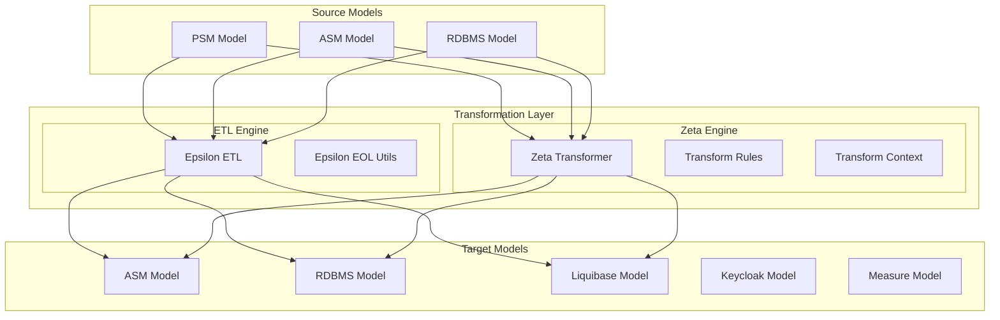
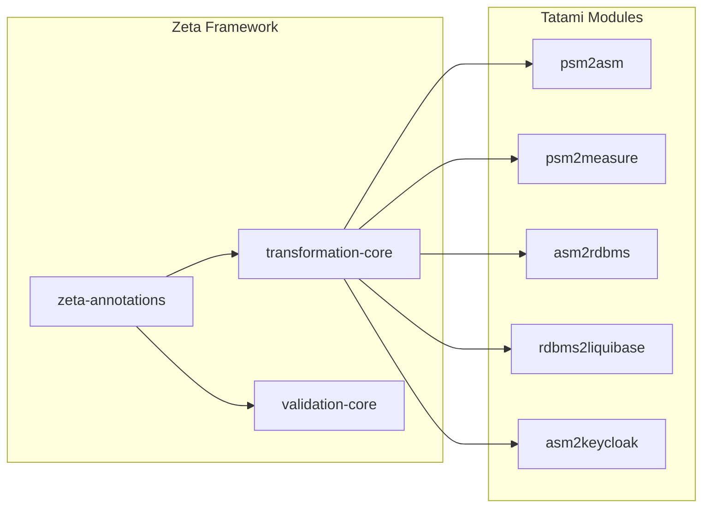

# Design: Zeta Dual Transformation System

## Architecture Overview



## Component Design

### 1. Transformation Mode Selection

```java
public enum TransformationMode {
    ETL,      // Use Epsilon ETL only
    ZETA,     // Use Zeta Java transformations only
    DUAL      // Run both and compare (test mode)
}

public interface TransformationService<S, T> {
    T transform(S source, TransformationMode mode);
}
```

### 2. Zeta Transformation Class Structure

Each transformation module follows this pattern:

```
judo-tatami-<source>2<target>/
├── src/main/java/.../
│   ├── <Source>2<Target>.java              # Existing ETL executor
│   ├── <Source>2<Target>Work.java          # Existing work class
│   ├── <Source>2<Target>TransformationTrace.java
│   └── zeta/
│       ├── <Source>2<Target>RuleNames.java     # Rule name constants
│       ├── <Source>2<Target>Transformation.java # Main Zeta transformer
│       └── rules/
│           ├── NamespaceRules.java         # Domain-specific rules
│           ├── TypeRules.java
│           └── ...
```

### 3. Rule Name Constants Pattern

```java
/**
 * Constants for PSM to ASM transformation rule names.
 * These constants ensure consistency between transformation rules
 * and any references to them (e.g., in traces, logs, or validations).
 */
public final class Psm2AsmRuleNames {
    private Psm2AsmRuleNames() {} // Prevent instantiation
    
    // Namespace rules
    public static final String NAMESPACE_TO_PACKAGE = "NamespaceToPackage";
    public static final String MODEL_TO_ROOT_PACKAGE = "ModelToRootPackage";
    
    // Type rules
    public static final String PRIMITIVE_TYPE_TO_EDATA_TYPE = "PrimitiveTypeToEDataType";
    public static final String ENUMERATION_TO_EENUM = "EnumerationToEEnum";
    public static final String ENUM_LITERAL_TO_EENUM_LITERAL = "EnumLiteralToEEnumLiteral";
    
    // Data rules
    public static final String ENTITY_TO_ECLASS = "EntityToEClass";
    public static final String ATTRIBUTE_TO_EATTRIBUTE = "AttributeToEAttribute";
    public static final String RELATION_TO_EREFERENCE = "RelationToEReference";
    
    // ... more constants
}
```

### 4. Zeta Transformation Implementation

```java
@TransformationContext(
    sourceModel = PsmModel.class,
    targetModel = AsmModel.class,
    name = "PSM to ASM Transformation"
)
public class Psm2AsmTransformation {
    
    private final AsmUtils asmUtils;
    
    @TransformRule(name = Psm2AsmRuleNames.ENTITY_TO_ECLASS)
    @Primary // This is the primary rule for Entity -> EClass mapping
    public EClass transformEntity(Entity entity, TransformationContext ctx) {
        EClass eClass = EcoreFactory.eINSTANCE.createEClass();
        eClass.setName(entity.getName());
        
        // Set package using equivalent lookup
        EPackage pkg = ctx.equivalent(entity.getNamespace(), EPackage.class);
        pkg.getEClassifiers().add(eClass);
        
        return eClass;
    }
    
    @TransformRule(name = Psm2AsmRuleNames.ATTRIBUTE_TO_EATTRIBUTE)
    public EAttribute transformAttribute(Attribute attr, TransformationContext ctx) {
        EAttribute eAttr = EcoreFactory.eINSTANCE.createEAttribute();
        eAttr.setName(attr.getName());
        
        // Get owning class
        EClass owner = ctx.equivalent(attr.getOwner(), EClass.class);
        owner.getEStructuralFeatures().add(eAttr);
        
        // Set type
        EDataType type = ctx.equivalent(attr.getType(), EDataType.class);
        eAttr.setEType(type);
        
        return eAttr;
    }
    
    @PostExecution
    public void enrichWithAnnotations(TransformationContext ctx) {
        AsmUtils utils = new AsmUtils(ctx.getTargetModel().getResourceSet());
        utils.enrichWithAnnotations();
    }
}
```

### 5. Dual Execution Test Framework

```java
public abstract class AbstractDualTransformationTest {
    
    protected abstract Object runEtlTransformation();
    protected abstract Object runZetaTransformation();
    
    @ParameterizedTest
    @EnumSource(TransformationType.class)
    void testTransformation(TransformationType type) {
        Object result = switch(type) {
            case ETL -> runEtlTransformation();
            case ZETA -> runZetaTransformation();
        };
        
        verifyResult(result);
    }
    
    @Test
    void testDualEquivalence() {
        Object etlResult = runEtlTransformation();
        Object zetaResult = runZetaTransformation();
        
        ModelComparator.assertEquivalent(etlResult, zetaResult);
    }
}
```

### 6. Model Comparison Utility

```java
public class ModelComparator {
    
    public static void assertEquivalent(EObject model1, EObject model2) {
        ComparisonResult result = compare(model1, model2);
        if (!result.isEquivalent()) {
            throw new AssertionError(
                "Models are not equivalent:\n" + result.getDifferences()
            );
        }
    }
    
    public static ComparisonResult compare(EObject model1, EObject model2) {
        // Compare structure
        // Compare element counts
        // Compare element names and properties
        // Compare references
        // Return detailed comparison result
    }
}
```

### 7. Performance Test Structure

```java
public class Psm2AsmPerformanceTest {
    
    private static final int LARGE_MODEL_SIZE = 10_000;
    
    @Test
    void comparePerformance() {
        // Generate large model
        PsmModel largeModel = ModelGenerator.generatePsmModel(LARGE_MODEL_SIZE);
        
        // Warm up
        runEtlTransformation(largeModel);
        runZetaTransformation(largeModel);
        
        // Measure ETL
        long etlStart = System.nanoTime();
        AsmModel etlResult = runEtlTransformation(largeModel);
        long etlDuration = System.nanoTime() - etlStart;
        
        // Measure Zeta
        long zetaStart = System.nanoTime();
        AsmModel zetaResult = runZetaTransformation(largeModel);
        long zetaDuration = System.nanoTime() - zetaStart;
        
        // Log results
        log.info("Performance comparison for {} elements:", LARGE_MODEL_SIZE);
        log.info("  ETL:  {}ms", TimeUnit.NANOSECONDS.toMillis(etlDuration));
        log.info("  Zeta: {}ms", TimeUnit.NANOSECONDS.toMillis(zetaDuration));
        log.info("  Ratio: {}", (double) etlDuration / zetaDuration);
        
        // Verify equivalence
        ModelComparator.assertEquivalent(etlResult, zetaResult);
    }
}
```

## Module Dependencies



## POM Configuration

### Parent POM Properties

```xml
<properties>
    <!-- Existing properties -->
    <epsilon-runtime-version>2.8.0.20250820_074004_d018a661_develop</epsilon-runtime-version>
    
    <!-- New Zeta property -->
    <judo-zeta-version>1.0.0.20251207_081454_0779b890_develop</judo-zeta-version>
</properties>
```

### Parent POM Dependency Management

```xml
<dependencyManagement>
    <dependencies>
        <!-- Existing dependencies -->
        
        <!-- Zeta Framework -->
        <dependency>
            <groupId>hu.blackbelt.judo.zeta</groupId>
            <artifactId>zeta-annotations</artifactId>
            <version>${judo-zeta-version}</version>
        </dependency>
        <dependency>
            <groupId>hu.blackbelt.judo.zeta</groupId>
            <artifactId>transformation-core</artifactId>
            <version>${judo-zeta-version}</version>
        </dependency>
        <dependency>
            <groupId>hu.blackbelt.judo.zeta</groupId>
            <artifactId>validation-core</artifactId>
            <version>${judo-zeta-version}</version>
        </dependency>
    </dependencies>
</dependencyManagement>
```

### Module POM Dependencies

```xml
<dependencies>
    <!-- Existing dependencies -->
    
    <!-- Zeta for Java transformations -->
    <dependency>
        <groupId>hu.blackbelt.judo.zeta</groupId>
        <artifactId>zeta-annotations</artifactId>
    </dependency>
    <dependency>
        <groupId>hu.blackbelt.judo.zeta</groupId>
        <artifactId>transformation-core</artifactId>
    </dependency>
</dependencies>
```

## Migration Strategy

### Incremental Approach

1. **Start with simplest module**: `psm2measure` (3 ETL files)
2. **Progress to core module**: `psm2asm` (9 ETL files)
3. **Continue with dependent modules**: `asm2rdbms`, `rdbms2liquibase`, `asm2keycloak`

### Rule-by-Rule Migration

For each ETL rule:
1. Analyze ETL rule logic
2. Create Java method with `@TransformRule`
3. Add to rule constants class
4. Write unit test for the rule
5. Verify equivalence with ETL output

### Backward Compatibility

- ETL files remain unchanged
- Both engines available at runtime
- Configuration option to select engine
- Default to ETL in production until Zeta is fully validated
